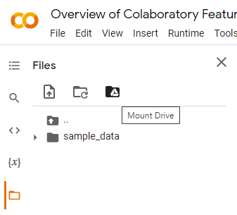

## Installation du repository sur Google Colab

1/ Copier l'ensemble des fichiers à la racine de [Google Drive](https://drive.google.com/drive/u/0/my-drive)

2/ A l'ouverture du notebook, monter le disque Google Drive :

3/ Initier le notebook en plaçant l'exécution de ce dernier dans le bon répertoire :

    cd /content/drive/MyDrive/datascience-initiation-student-dataset/

Note : les liens vers d'autres notebooks ne fonctionnent pas.