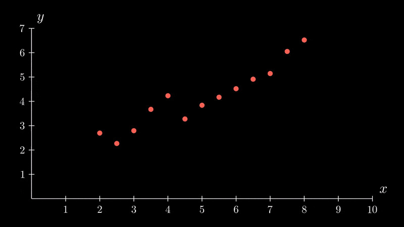
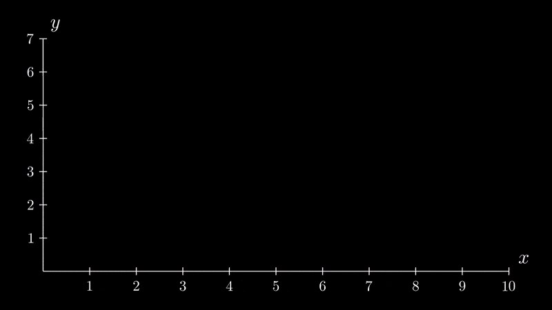

# Comprendre le principe de la régression linéaire
---
## Principe
La régression linéaire est probablement un des algorithmes les plus simples mais aussi les plus utilisés, notamment parce qu'énormément de phénomènes de la vie courante sont eux-mêmes linaires (aussi appelés "situation de proportionnalité") :

*Linéarité positive :*
- Plus le réservoir d'une voiture est grand, plus le plein d'essence va être onéreux
- Plus un randonneur marche (à vitesse constante), plus il va parcourir une grande distance
- Plus un magasin vend un article, plus son chiffre d'affaires augmente

*Linéarité négative :*
- Plus il y a de convives pour partager une pizza, moins la part de chacun sera grande
- Plus il y a de nuages dans le ciel, moins il y aura de luminosité

## Exemple d'application
Nous avons placé un GPS sur un jeune Labrador pour mesurer la distance qu'il parcourt lorsqu'il se balade avec son maitre, en fonction de la durée.

Nous avons reporté ces points sur le graphique ci-dessous :

*abscisse (x): durée de la balade en heure*
*ordonnée (y): distance parcourue en km*

Par exemple, nous pouvons voir que lors d'une balade de 2h, il a parcouru un peu moins de 3 kms... ou que lors d'une très longue balade de 7h, il a parcouru 5 kms.

La question à laquelle le modèle doit répondre est : quelle distance sera parcourue en fonction de la durée de la balade ?

Exprimé sous une forme mathématique, cela revient à trouver :

$$distance = durée * coefficient_a + coefficient_b$$

De la même manière que nous pourrions le faire avec une simple règle sur une feuile de papier, l'algorithme va positionner une première ligne qui correspond à une équation de départ :

$$y_{distance} = durée * 1,07 + 1,17$$

Le modèle va alors calculer la distance entre chaque point et la ligne, que nous pouvons appeler l'"erreur moyenne". Ici, elle est de **0.849** *

(* le calcul du "MSE" ou "Mean Squared Error" est complexe, nous ne l'abordons pas ici)

Le modèle va ensuite modifier l'équation de la droite en tentant de réduire au maximum l'erreur ; c'est une opération d'optimisation.

L'équation finale est alors :

$$y_{distance} = durée * 0,62 + 1,06$$

Et l'erreur moyenne est devenue **0,155**, 5 fois moins que le premier essai !

Voici l'animation correspondante :

## Etablir une prédiction

Sur la base de ce modèle (= équation), nous pourrions également prédire quelle serait la distance parcourue sur une durée qui n'a pas été testée.

Essayons avec 1h de balade :

$$y_{distance} = 1 * 0,62 + 1,06 = 1.68km$$

Cependant, un modèle présente toujours des limites, notamment le fait qu'il est dangereux de faire des prédictions en dehors de la plage de valeurs sur laquelle il a été entrainé.

Par exemple, si nous réalisons le même calcul pour 30 heures de balade, l'équation nous renverra bien une valeur :

$$y_{distance} = 30 * 0,62 + 1,06 = 19,66km$$

... mais notre jeune Labrador sera épuisé bien avant d'avoir autant marché !